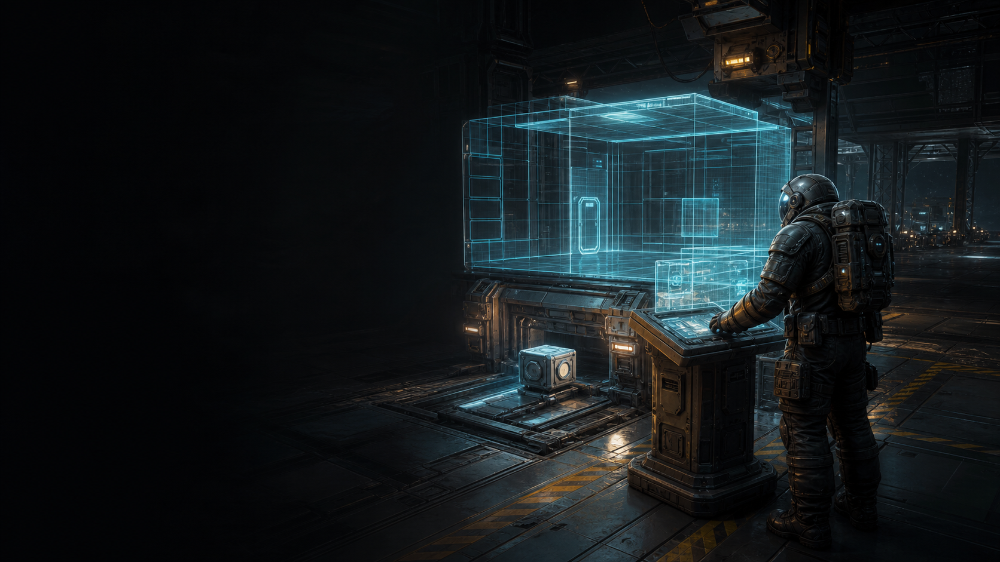

# Worldwright

[Campaign README](../../README.md) | [Standalone mods index](../README.md)

<p align="center">
  
</p>

**Worldwright** is a standalone Space Engineers scenario-authoring toolkit.

It provides small, reusable tools for builders who want stronger control over tutorial spaces, stations, reclamation bays, and scripted scenario moments without making those tools specific to Beneath the Crust.

## Current Features

- Protected grids can block grinder damage without using a safe zone.
- Separate scrap or tutorial grids remain grindable if they are not protected.
- Protection is server-side and applies to normal grinder damage.
- Block Spawners create configurable one-block dynamic grids for authored bays and scenario machinery.
- Spawner sequences support duplicate entries, search across loaded public blocks, and Once, Loop, or Random selection.
- Timer blocks and other vanilla automation can use the spawner's `Spawn Next` and `Reset Sequence` toolbar actions.

Public docs:

- [Workshop description](../../docs/Worldwright/workshop_description_bbcode.txt)
- [Changelog](../../docs/Worldwright/changelog.md)

## Grind Protection

Worldwright protects a grid when either condition is true:

- The grid name contains `G-PROT`, such as `Special Station G-PROT`.
- Any terminal block on the grid has this in Custom Data:

```ini
[Worldwright]
protected=true
```

Protected grids cancel grinder damage before it is applied. This is intended for stations, tutorial rooms, spawn areas, and scenario infrastructure that players should be able to use but not dismantle.

The name token is intentionally simple so scenario scripts, admin tools, or builders can add or remove protection by renaming the grid.

This is not a safe zone replacement. It does not block movement, welding, terminal access, weapon damage, collisions, or ownership changes.

## Block Spawner

The **Worldwright Block Spawner** is a compact large-grid terminal block using the standard vanilla Air Vent shell as a directional hatch. Payloads leave through the visible grille on its front face, and its built-in access panel opens the Block Spawner settings directly.

The terminal provides:

- A search field and filtered list of every loaded public cube-block definition.
- An ordered spawn sequence with Add, Remove, Move Up, and Move Down controls.
- `Once`, `Loop`, and `Random` sequence modes.
- A `Spawn Next` button and toolbar action.
- A `Reset Sequence` button and toolbar action.
- Optional automatic Start and Stop controls with a configurable `0.1-60 second` interval.
- An outward velocity slider from `0` to the vanilla grid speed of `100 m/s`.
- A `0-100%` starting-rotation variance without angular velocity or continued spinning.
- A random integrity range from `10-100%`.
- A weighted list of captured paint-and-skin appearance presets.
- Optional directly rendered smoke with Off, Always, and Bursts modes.
- A vanilla smoke-effect selector, optional experimental RGB tint multipliers, and particle-density controls without changing the spawner's terminal block type.

Each list entry represents one spawn. Add the same block three times when it should appear three times. Duplicate entries also act as weighting in Random mode.

`Spawn Next` requests one grid containing one fully built, unowned block. If the required volume is occupied, the request waits until the area clears. Repeated requests do not build an invisible queue; each spawner holds at most one waiting request.

The new grid inherits the source grid's current linear velocity, then adds the configured velocity away from the recessed face. Worldwright deliberately does not clamp the resulting vector so local testing can show how vanilla world physics handles launches from a moving grid.

Automatic mode requests its first spawn immediately. After every successful spawn, it waits for the configured interval before requesting another. A blocked output pauses the sequence without building a queue. Once mode stops automatically at the end; Loop and Random continue until stopped. Automatic running is runtime state and starts stopped after a world reload.

Rotation variance changes only the grid's starting orientation. Zero percent keeps every payload aligned with the Block Spawner. One hundred percent chooses a completely random three-dimensional orientation. The chosen rotation remains fixed while that spawn waits for clearance.

Minimum and maximum integrity default to `100%`. Lower ranges create fully constructed but damaged parts. Every pending spawn chooses one integrity value and keeps it while waiting.

To build an appearance list, paint and skin the Block Spawner with the vanilla paint tool, then press `Add Current Appearance`. Repaint it and add another preset as many times as needed. Each spawn randomly chooses one preset; duplicate presets add weight. When the list is empty, the current Block Spawner appearance is used directly.

Spawner configuration is stored in the block's Custom Data under `[Worldwright.BlockSpawner]`. Worldwright preserves other Custom Data sections when updating this configuration.

The four vent indicators show spawner status: green counts through an automatic interval, amber means the next payload is waiting for clearance, red reports a damaged spawner or missing block definition, purple marks a completed Once sequence, dim cyan means ready, and unlit means the sequence is empty.

Smoke Mode defaults to Off. Always continuously emits from the front grille, which can help conceal the hatch in a reclamation chute. Bursts waits until the next payload has enough room, builds smoke for one second, then stops emitting as the payload spawns. Existing particles dissipate naturally. If the output becomes obstructed during the lead-in, the burst is cancelled and primed again when the area clears. Smoke Effect selects Default, White, Vehicle, or Reactor exhaust using the vanilla authored appearance. Red, Green, and Blue Tint Multiplier sliders accept `0-255`; neutral `255,255,255` preserves the selected effect, while lower values filter its authored channels. Reset Smoke Tint restores the neutral values. Smoke Intensity changes particle density from `10-100%` without changing particle size.

Smoke is created directly through Space Engineers' particle system. Effect, tint, and intensity changes recreate the emitter so GPU particles cannot retain a stale live setting. The spawner remains a normal TerminalBlock, so its terminal panel and toolbar actions are unaffected. Burst state is synchronized from the server for multiplayer clients.

## Planned Direction

Future Worldwright features may include trigger volumes, staged prefab or blueprint drops, scenario reset helpers, and other reusable tools for authored Space Engineers experiences.
